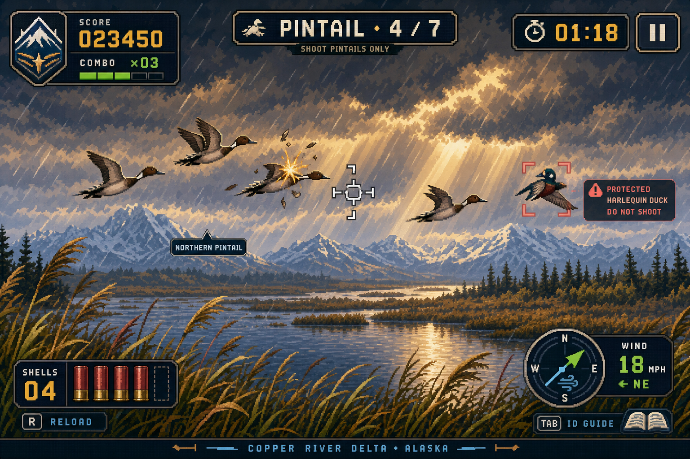

# ALASKA DUCK HUNT



An original retro-modern browser hunting game set across Alaska’s flyways, coasts, forests, tundra, and alpine country. Track fast procedural flights, identify targets, avoid protected lookalikes, master shifting weather, and progress north through a local-first campaign.

This project is an affectionate tribute to the _format and spirit_ of classic light-gun arcade games. It contains no Nintendo code, ROM data, art, audio, characters, typography, or other proprietary assets.

## Release status

Version 1.0 is a playable static PWA. The production flow includes splash, campaign and mode selection, briefing, live hunt, pause, scoring/results, field guide, records, settings, controller lab, offline installation, and responsive layouts. The pure deterministic engine, versioned save format, scoring, input translation, and migrations have automated coverage.

## Features

- Crisp original pixel-art direction with layered Alaska scenery, animated flight and feathers, weather-ready palettes, HUD impact feedback, and optional accessibility effects.
- Ten reference-informed animated bird sprite sheets with four flight frames across four documented sex, morph, age, or seasonal variants, used in live hunts and the field guide.
- Campaign spanning 12 named Alaska habitats, plus Classic Hunt, Endless Migration, Species Challenge, Identification Challenge, Time Trial, Practice Range, Daily Seed, and Custom Hunt.
- Seeded reproducible rounds with species roles, wind, weather, visibility, formations, flock size, speed, altitude, ammunition, and varied flight behaviors.
- Keyboard, mouse, touch-pointer, fullscreen, abstract controller packets, and a simulated future Zapper pathway.
- Field-guide entries with identification traits, flight, habitat, similar species, protected lookalikes, broad status context, citations, verification dates, and legal reminders.
- Local profiles/settings and a versioned save/migration core with corruption recovery and JSON export.
- Original Web Audio synthesis with no autoplay; independent audio architecture is documented.
- Installable PWA with generated service worker and offline precache.
- No ads, accounts, loot boxes, tracking, or monetization.

## Controls

| Action          | Default                           |
| --------------- | --------------------------------- |
| Aim             | Mouse / touch / WASD / arrow keys |
| Fire            | Left click / tap / Space          |
| Reload          | R                                 |
| Pause           | Escape                            |
| Confirm / focus | Enter / Tab                       |
| Fullscreen      | F                                 |
| Mute            | M                                 |

## Install and run

Requires Node.js 22 or newer.

```bash
npm install
npm run dev
```

Open **http://localhost:8000**. `npm run dev` starts Vite with a strict port reservation and transforms TypeScript modules into browser-compatible JavaScript. Do not run `python -m http.server` (or another generic static server) from the source repository: it serves raw `.ts` files with the wrong MIME type. If port 8000 is occupied, identify the owner with `lsof -nP -iTCP:8000 -sTCP:LISTEN` or `ss -ltnp '( sport = :8000 )'`, stop it only if it belongs to this project, then rerun `npm run dev`.

For a production build and local production preview:

```bash
npm run build
npm run preview
```

The preview is served at **http://localhost:4173**. On generic static hosting, publish the generated `dist/` directory—never the source repository.

Mouse is the dependable default while the ESP32 Zapper is in development: move over the hunt canvas to aim and left-click once to fire. Keyboard controls remain available: WASD/arrows aim, Space fires, R reloads, Escape pauses/resumes, F toggles fullscreen, and M mutes. Clicking menus, settings, pause controls, or results does not fire.

## Validation

```bash
npm run typecheck
npm run lint
npm test
npm run build
npm run test:e2e
npm run check
npm run generate:assets
npm run validate:assets
```

The build output is `dist/`. Test it with `npm run preview`; generic static hosting must serve `dist/`, not raw project sources.

## PWA installation

Serve the production build over HTTPS (localhost is also allowed by browsers), open the site, and choose the browser’s Install/Add to Home Screen action. Once the service worker has cached the release, the installed game starts offline. Updates are prompted through the generated PWA registration strategy.

## Architecture

Phaser renders the responsive pixel-perfect playfield. Accessible DOM screens and overlays handle menus and settings. Pure strict-TypeScript modules under `src/core` own RNG, round plans, scoring, input translation, and save migration; they do not depend on Phaser. Data lives in `src/data`, Web Audio and persistence live behind services, and Vite emits a static offline-capable application. See [architecture](docs/architecture.md), [procedural generation](docs/procedural-levels.md), and [input system](docs/input-system.md).

## Original media pipeline

The visual system uses a generated concept spec, code-native pixel rendering, a checked-in palette generator, original SVG application icon, and nearest-neighbor scaling. Audio is synthesized after player interaction. See [art direction](docs/art-direction.md), [asset pipeline](docs/art-pipeline.md), and [audio system](docs/audio-system.md).

## Accessibility

Menus have visible keyboard focus, semantic controls, high contrast and responsive text. Settings cover aiming, reticle size/contrast, reduced motion, reduced flashing, screen shake, scanlines, text scaling and independent volumes. The game respects `prefers-reduced-motion`, pauses at any time, and avoids color-only target language. Details are in [accessibility](docs/accessibility.md).

## Deployment

The included GitHub Actions workflow installs, validates, runs Chromium smoke tests, uploads `dist/`, and deploys GitHub Pages after successful main-branch checks. `base: './'` also supports generic static hosting. See [deployment](docs/deployment.md).

## Future ESP32 controller

Gameplay consumes abstract actions rather than hardware APIs. The controller lab can emit simulated trigger, reload, calibration and aim events today. The proposed BLE/Web Serial packet format includes aim, IMU, battery, firmware, identifier, timestamps and connection state. See [ESP32 protocol](docs/esp32-controller-protocol.md).

## Regulatory disclaimer

**ALASKA DUCK HUNT is a fictional arcade game—not hunting instruction or legal advice.** Its round limits, seasons, scores, locations and objectives are invented for play. Real rules change by year, species, region and game-management unit, land manager, residency and subsistence eligibility, permit or registration requirement, emergency order, and hunting method. Before hunting, identify every bird and consult current Alaska Department of Fish and Game regulations, applicable U.S. Fish & Wildlife Service regulations, emergency orders, permit conditions, and land-manager rules. If uncertain, do not shoot.

Research policy and authoritative links are documented in [regulatory sources](docs/regulatory-sources.md) and [species data](docs/species-data.md).

## Contributing, license, and credits

See [CONTRIBUTING.md](CONTRIBUTING.md), [CODE_OF_CONDUCT.md](CODE_OF_CONDUCT.md), and [CHANGELOG.md](CHANGELOG.md). Code and original generated game assets are released under the [MIT License](LICENSE). Regulatory facts are attributed to their official public sources; agency names and marks are not project endorsements.
